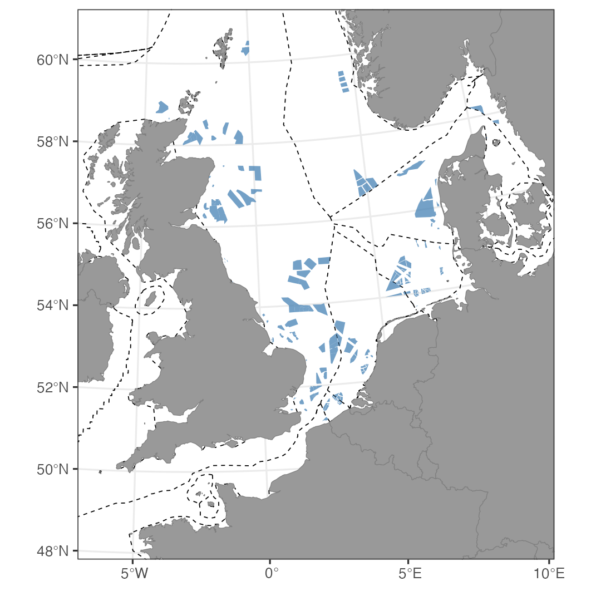

```{r setup, include = FALSE}
knitr::opts_chunk$set(
  collapse = TRUE,
  comment = "#>",
  eval = FALSE
)
```


In the guide to [making a map](mapr.html) we use animal tracking data to define
the region of interest. You don't have to: `mapr()` only needs a table with
`lon` and `lat` columns, so two corner points are enough to describe a study
area.

This guide shows how using `mapr` in combination with publicly available
datasets we can quickly map the offshore wind farms expected in the North Sea
by 2030, with maritime boundaries, and no tracking data at all.


 
## Getting the data

Wind farm footprint data are available from the recent paper by Critchley et al. 
published in [Journal of Applied Ecology](https://doi.org/10.1111/1365-2664.70087).
The dataset is available through Zenodo and can be read directly into R from the website.

Data on marine boundaries are available through [Marine Regions](https://www.marineregions.org/)
and can be queried through the `mregions2` package and filtered to the North Sea states.

```{r packages}
library(sf)
library(mregions2)
library(mapr)
library(ggplot2)

# Wind farm footprints
owf_poly <- st_read("/vsicurl/https://zenodo.org/records/10478448/files/North_Sea_OWF_2030_polygons.shp")

# EEZ boundaries for the North Sea states
ns_states <- "('GBR','NOR','DNK','DEU','NLD','BEL','FRA')"
eez_lines <- mrp_get(
  "eez_boundaries",
  cql_filter = paste("sovereign1 IN", ns_states, "OR sovereign2 IN", ns_states)
)
```

## Getting a shapefile from `mapr`

Rather than a set of tracks, give `mapr()` the two corners of the area you
want. The `buff` argument then extends the coastline beyond them, and
`scale = "large"` asks for the highest resolution Natural Earth coastline,
which is worth it at this scale because so much of the map is coastline:

```{r land}
prj <- "+proj=utm +zone=30 +datum=WGS84 +units=m +no_defs"

corners <- data.frame(lon = c(-10, 15), lat = c(45, 65))
land <- mapr(corners, prj, buff = 2e5, scale = "large")
```

`scale = "large"` needs the `rnaturalearthhires` package, which is not on
CRAN:

```{r hires}
install.packages("rnaturalearthhires",
                 repos = "https://ropensci.r-universe.dev")
```

## The map

Boundaries first, so the land sits over them, then the wind farms on top.
The limits are in metres, because the projection is:

```{r map}
ggplot() +
  theme_bw(base_size = 8) +
  geom_sf(data = eez_lines, colour = "black", linetype = "dashed", linewidth = .2) +
  geom_sf(data = land, colour = "grey50", fill = "grey60") +
  geom_sf(data = owf_poly, colour = NA, alpha = 0.75, fill = "steelblue") +
  coord_sf(xlim = c(200000, 1500000), ylim = c(5300000, 6800000), crs = prj, expand = FALSE)
```

Both external layers arrive as `sf` objects with their own coordinate
reference systems, and neither is projected here. `coord_sf()` reprojects
every layer to `prj` as it draws, so they line up with the land without any
`st_transform()` calls.

To add the map furniture from the
[main guide](mapr.html), build the frame from the same corner
coordinates you gave `mapr()`, and remember that `buff` needs to be large
enough for the land to reach past the frame on every side.

## Footnote

The two layers above are read straight off the web, with nothing downloaded by
hand. This can be useful if you don't want to store data locally or when files
may be remotely updated and you want the most recent data set.

EMODnet also supplies shapefiles on windfarm locations and status, and can be
accessed as follows:

```{r emodnet}
wfs <- "https://ows.emodnet-humanactivities.eu/wfs"

owf_emod <- st_read(paste0(
  "WFS:", wfs,
  "?service=WFS&version=2.0.0&request=GetFeature&typeName=emodnet:windfarmspoly"
))

# Check windfarm build status
table(owf_emod$status)
```

The `status` column separates farms in production from those approved, under
construction or planned, so it's worth looking at the table before filtering:
the wording of those categories changes from one version of the dataset to the
next.

This layer would drop into the map above with another `geom_sf()` call, in whatever
projection it happens to arrive in, because `coord_sf()` does the reprojecting.

## Sources

Wind farm footprints: <https://zenodo.org/records/10478448>

Maritime boundaries: Flanders Marine Institute, Marine Regions,
<https://www.marineregions.org/>

Check the licence and citation for each before using either in published work.

